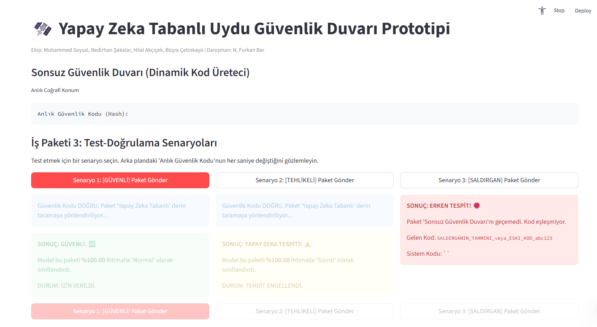

# 🛰️ AI-Based Satellite Security Firewall Prototype

This repository contains the official prototype for the project titled "An AI-Based Dynamic Protection Approach Against Cyber Leaks for Data Security in Satellites," developed for the TÜBİTAK 2209-A Research Projects Support Program.

## 🎯 Project Aim

This system provides a two-layer hybrid security architecture designed to protect satellite data communications.

1.  [cite_start]**The Infinite Firewall (Dynamic Layer):** This is a dynamic authentication mechanism based on random geographical coordinates (degree, minute, second) [cite: 34-37, 81]. [cite_start]It generates a new, unique security hash (password) every second, making brute-force and replay attacks statistically impossible [cite: 38-41].
2.  **The AI Core (Analysis Layer):** If a data packet successfully passes the dynamic layer (i.e., it has the correct, current hash), it is forwarded to the second layer. [cite_start]This layer uses a pre-trained Random Forest AI model [cite: 19] to analyze the packet's contents and classify it as either "Normal" or "Leak" (Anomaly) with 100% accuracy on the test set.

## 🚀 How to Run the Prototype
## 📸 Prototype Interface

Here is a screenshot of the Streamlit prototype in action:



1.  **Clone the Repository:**
    ```bash
    ```

2.  **Install Dependencies:**
    It is highly recommended to use a virtual environment.
    ```bash
    # Install the required libraries
    pip install -r requirements.txt
    ```

3.  **(Optional) Re-generate the Model:**
    You can re-train the AI model and create the dataset by running the scripts in order:
    ```bash
    # 1. Create the dataset (uydu_veri_seti.csv)
    python adim_1_veri_uretme.py
    
    # 2. Train and save the AI model (siber_guvenlik_modeli.joblib)
    python adim_2_model_egitme.py
    ```

4.  **Run the Visual Prototype (Streamlit App):**
    [cite_start]This is the main simulation file (`adim_5_gorsel_arayuz.py`) which provides a web interface for testing[cite: 153].
    ```bash
    streamlit run adim_5_gorsel_arayuz.py
    ```

5.  **Open the App:**
    Your browser will automatically open to `http://localhost:8501`.

    [cite_start]To test this on the tablet (as specified in the project budget [cite: 159]), find your computer's local IP address (e.g., `192.168.1.XX`) and open `http://192.168.1.XX:8501` in your tablet's web browser.
